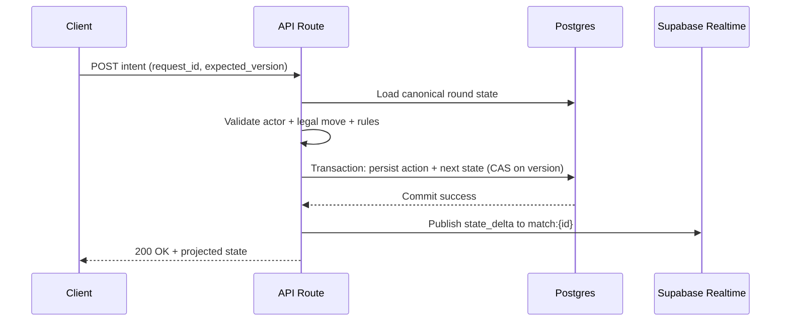
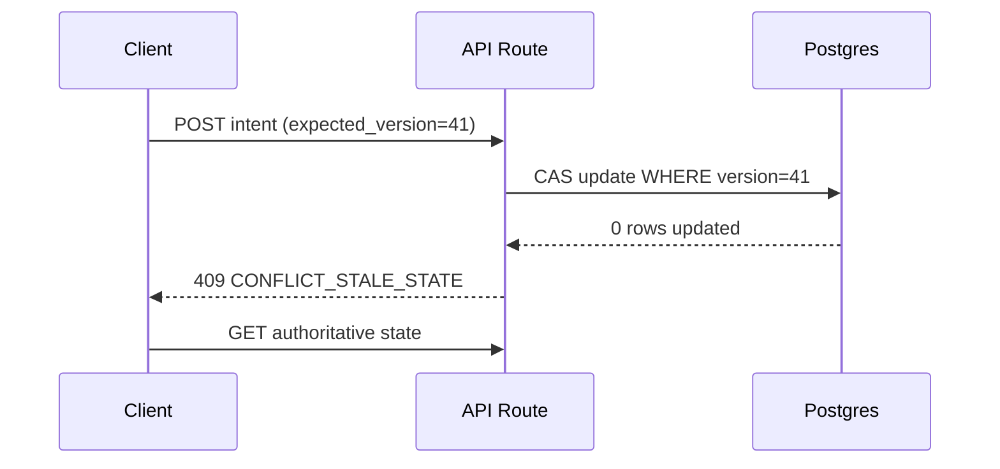
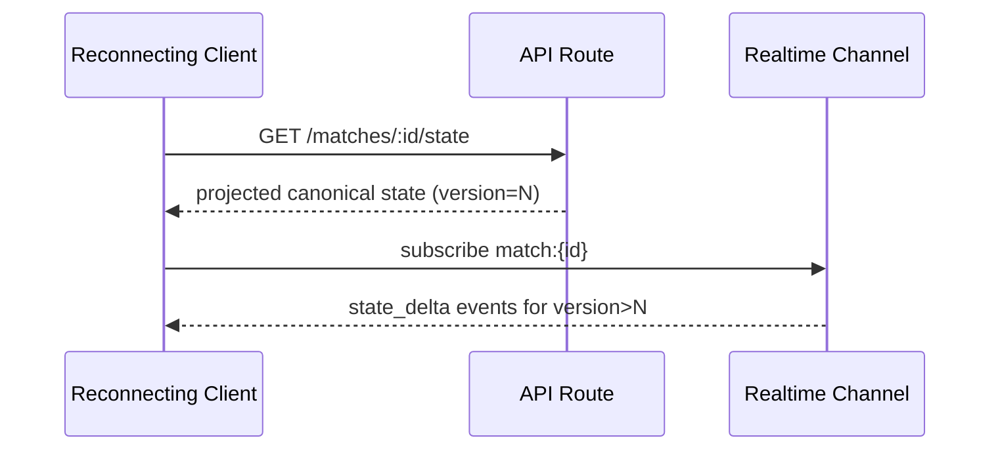

# ARCHITECTURE.md - Twenty-Eight Web App (Vercel + Supabase Realtime)

This document defines the runtime architecture for implementing Twenty-Eight as described in `docs/AGENT.md` and `docs/RULES.md`.

## 1. Architecture Overview

System style:
- Client-server, server-authoritative game engine
- Stateless compute on Vercel Functions
- Durable state in Supabase Postgres
- Realtime fanout via Supabase Realtime channels

Core principle:
- Clients send intents.
- Server validates intent against canonical state.
- Server persists next state transactionally.
- Server emits state delta events.

## 2. Main Components

1. Next.js Web App (`apps/web`)
- UI for lobby, table, bidding, trick play, scoring
- Session-aware projected state rendering
- Subscribes to `match:{id}` realtime channel

2. API Layer (Next.js Route Handlers / Server Actions)
- Authenticates actor
- Validates payloads (`zod`)
- Calls game-core transitions
- Persists state + action log
- Publishes realtime events

3. Game Core (`packages/game-core`)
- Pure rules engine from `docs/RULES.md`
- Deterministic legal move validation
- Transition functions: bid/play/reveal/resolve

4. Data Layer (Supabase)
- Postgres tables for lobbies, matches, rounds, actions
- RLS enforced per match membership
- Realtime channel for low-latency updates

## 3. Trust Boundaries

Trusted:
- Backend function code
- Postgres stored canonical state

Untrusted:
- Browser client payloads
- Realtime event arrival order at client

Rule:
- Only server can mutate canonical game state.

## 4. Canonical State and Projections

Canonical state (stored):
- full hands all seats
- trump hidden/revealed internals
- bid and turn metadata
- version/action sequence

Per-player projection (returned/broadcasted):
- own hand: full cards
- opponents' hands: hidden count only
- public table/trick/score state

Never emit hidden cards for non-owner seats.

## 5. Data Model (Minimum)

## 5.1 Tables
- `users`
- `lobbies`
- `lobby_players`
- `matches`
- `rounds`
- `actions`
- `idempotency_keys`

## 5.2 Required columns (key fields)
`matches`
- `id`, `lobby_id`, `status`, `current_round_no`, `team_a_score`, `team_b_score`, `version`, `created_at`

`rounds`
- `id`, `match_id`, `round_no`, `phase`, `dealer_seat`, `current_turn_seat`, `bidder_seat`, `bid_value`, `trump_suit`, `trump_revealed`, `state_json`, `version`, `created_at`

`actions`
- `id`, `match_id`, `round_id`, `actor_id`, `action_type`, `request_id`, `expected_version`, `accepted`, `result_json`, `created_at`

`idempotency_keys`
- `id`, `match_id`, `actor_id`, `request_id`, `response_json`, `created_at`

## 6. Concurrency and Idempotency

Concurrency:
- Every state-changing intent must include `expected_version`.
- Update uses compare-and-swap semantics.
- If version mismatch, reject with `409 CONFLICT_STALE_STATE`.

Idempotency:
- Every intent includes `request_id`.
- If `(match_id, actor_id, request_id)` already exists, return stored response.
- Never apply same request twice.

## 7. Realtime Strategy

Channel naming:
- `match:{match_id}`

Event types:
- `state_delta`
- `trick_resolved`
- `round_resolved`
- `match_resolved`
- `player_disconnected`
- `player_reconnected`

Delivery model:
- Realtime is best-effort push.
- API `GET /matches/:id/state` is source of truth for recovery.

## 8. API Surface (Minimum)

Read endpoints:
- `GET /api/lobbies/:id`
- `GET /api/matches/:id/state`
- `GET /api/matches/:id/history`

Write endpoints (intents):
- `POST /api/lobbies`
- `POST /api/lobbies/:id/join`
- `POST /api/matches/:id/start`
- `POST /api/matches/:id/intents/place-bid`
- `POST /api/matches/:id/intents/pass-bid`
- `POST /api/matches/:id/intents/choose-trump`
- `POST /api/matches/:id/intents/play-card`
- `POST /api/matches/:id/intents/request-trump-reveal`
- `POST /api/matches/:id/intents/declare-pair`
- `POST /api/matches/:id/intents/call-double`
- `POST /api/matches/:id/intents/call-redouble`

## 9. Critical Sequence Flows

## 9.1 Move Processing (authoritative)

## 9.2 Conflict Handling

## 9.3 Reconnect and Resync

## 10. Security Model

- Authenticate every API request.
- Authorize match membership and seat ownership.
- Enforce RLS policies on Supabase tables.
- Validate all payloads with strict schemas.
- Rate-limit intent endpoints.

## 11. Failure Modes and Recovery

1. Realtime event dropped
- Client detects version gap and performs full state fetch.

2. Duplicate submit
- Idempotency key returns existing response.

3. Simultaneous actions
- Version conflict rejects stale action.

4. Mid-round disconnect
- Seat reserved during reconnect timeout.

## 12. Observability

Log fields on every write intent:
- `match_id`, `round_id`, `actor_id`, `request_id`, `action_type`, `expected_version`, `result_version`, `latency_ms`, `accepted`

Track metrics:
- intent success rate
- conflict rate
- illegal action rate
- reconnect success rate
- round duration

## 13. Non-Negotiable Implementation Rules

- Keep `packages/game-core` pure and deterministic.
- Never compute trick winners on client authority.
- Never expose hidden opponent cards.
- Never mutate match state without version checks.
- Never accept write intents without `request_id`.
